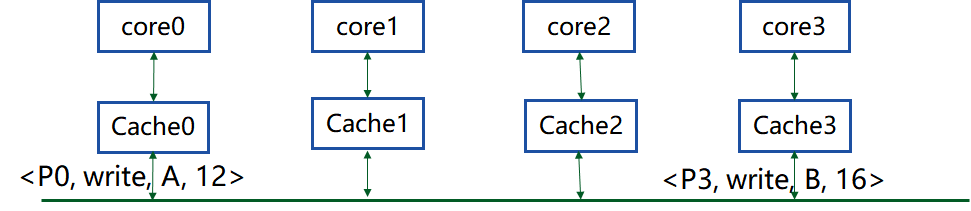

# lab2

设计并实现方案,使你的CC模拟器能够处理并发的访存操作

输入格式:

<pi, op, addr, value1>, none, <pj, op, addr, value2>, …

说明:每行最多四个三元组,表示同时发出的四个访存,none表示对应的cache没有访存请求.

- Cache block size不小于32字节,不超过32K字节
- Cache block状态不少于4个
- 完成四个数据集的测试,包括作业01的三个数据集